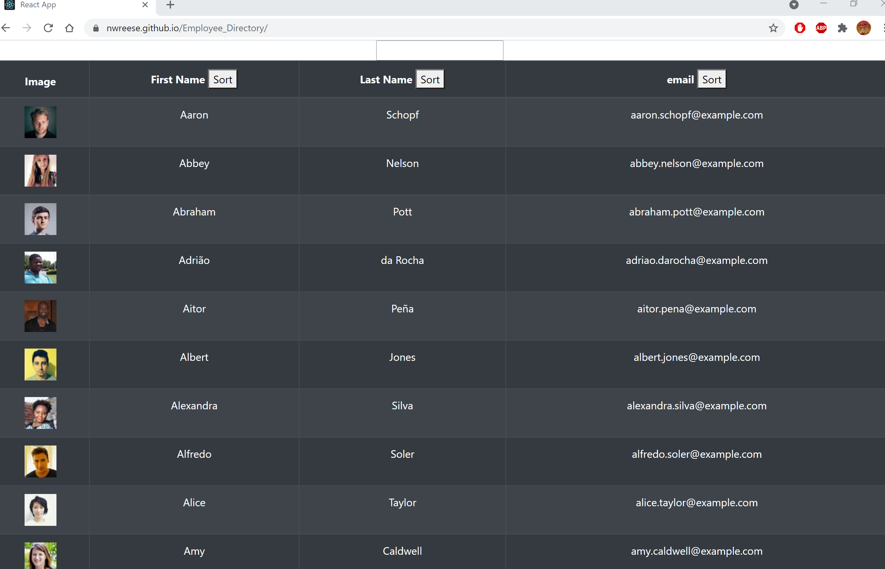
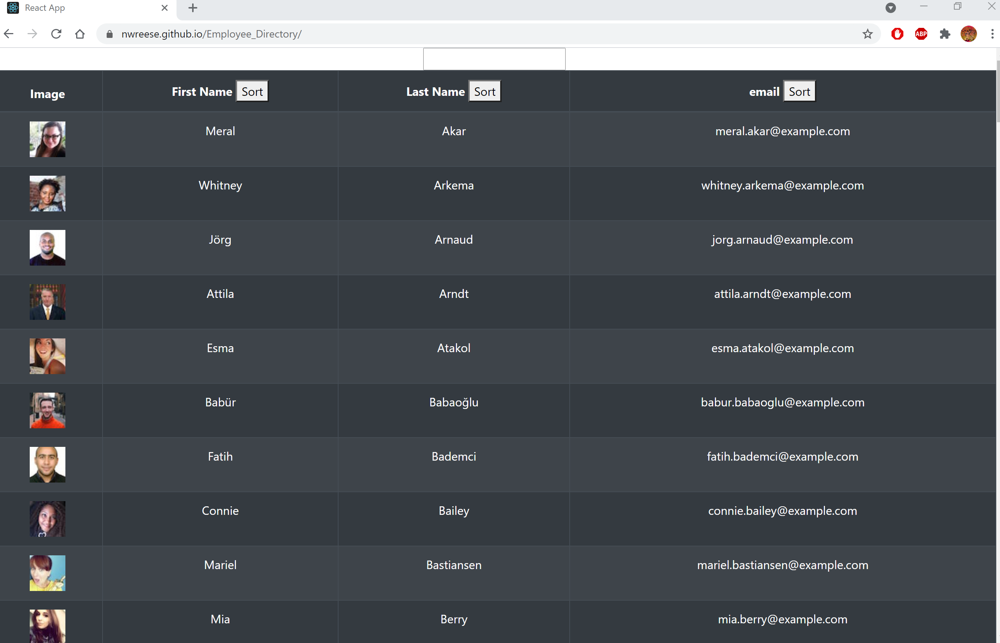
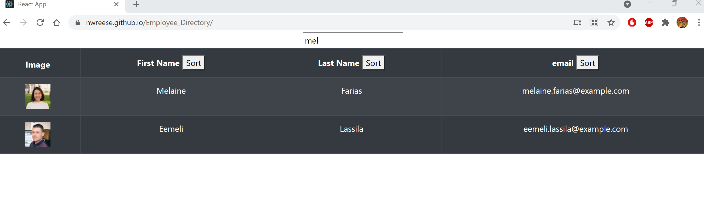

# Employee_Directory
This employee directory application is made with React and allows the user to view their entire employee directory. It also allows the user to filter through the directory by first name and sort the emails, as well as first and last names alphabeticaly. This application uses the random user api to generate the employee data. 

# Deployment 
Application deployed at https://nwreese.github.io/Employee_Directory/

# Screenshots

 

 

# Questions
email: nwreese@kent.edu
